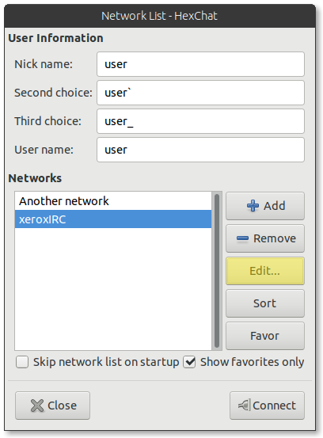

#### Step 1

Open HexChat and press `Ctrl` + `S` to open the network list.

#### Step 2

Select the network you want to enable TLS for and press `Edit`.

#### Step 3

*If the server address ends in `/6667`, remove that part by double-clicking the
address field, deleting `/6667`, then pressing enter to save your changes.*

Check "Use SSL for all servers on this network" and make sure "Accept invalid
SSL certificates" is **unchecked**.

#### Step 4

Now close the edit server dialog and reconnect to the IRC network. TLS should
be enabled. You can verify that TLS is enabled by doing
`/whois <your nickname>` and making sure
`<your nickname> is using a secure connection` appears.

