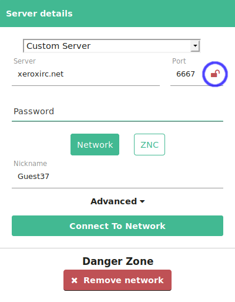

To enable TLS/SSL on KiwiIRC for xeroxIRC, you can select the `xeroxIRC` option
in the server dropdown box (it should be near the bottom).

If you are trying to enable TLS/SSL for another IRC network, or can't find the
xeroxIRC option, you can simply press the red padlock icon on the "Custom
Server" page:

The padlock should turn green and the port should change to `6697`.
