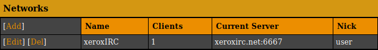

*Note that this document only covers how to secure the connection between ZNC
and the IRC network, not between your IRC client and ZNC.*

You can either enable TLS/SSL using webadmin (easiest) or \*status.

#### Enabling TLS using webadmin

##### Step 1

Open the ZNC webadmin page (normally `https://your-znc-ip:zncport` for TLS or
`http://your-znc-ip:zncport` for non-TLS/SSL), select "Your settings", and
scroll down to "Networks". The networks list should look something like this:



##### Step 2

Scroll down to "Servers of this IRC network", check "SSL", and set the
port to `6697`.


##### Step 3

Scroll down to the bottom of the page and click .

If ZNC doesn't automatically reconnect, you can run `/znc connect` to reconnect
to the IRC network.

After reconnecting, you can verify that TLS is enabled by doing
`/whois <your nickname>` and making sure
`<your nickname> is using a secure connection` appears.

#### Enabling TLS using \*status

##### Step 1

List the IRC servers currently active with `/znc listservers`.

This should make \*status PM you something like this:

```
+---------------+------+-----+----------+
| Host          | Port | SSL | Password |
+---------------+------+-----+----------+
| xeroxirc.net* | 6667 |     |          |
+---------------+------+-----+----------+
```

*If you are following these instructions for a network other than xeroxIRC,
make sure you remember the hostname.*

##### Step 2

You can then remove any servers in this list with
`/znc delserver <host> <port>`. Remember to omit the trailing \* (if any)
from the server host.

##### Step 3

You can now re-add the server with TLS/SSL with
`/znc addserver xeroxirc.net +6697`. If you are following these instructions
for a network other than xeroxIRC, replace `xeroxirc.net` with the hostname/IP
of the network.

Now the output of `/znc *listservers` should look something like this:

```
+---------------+------+-----+----------+
| Host          | Port | SSL | Password |
+---------------+------+-----+----------+
| xeroxirc.net* | 6697 | SSL |          |
+---------------+------+-----+----------+
```

*If there is no trailing \*, you may need to run `/znc connect` to reconnect
to IRC.*

After reconnecting, you can verify that TLS is enabled by doing
`/whois <your nickname>` and making sure
`<your nickname> is using a secure connection` appears.
